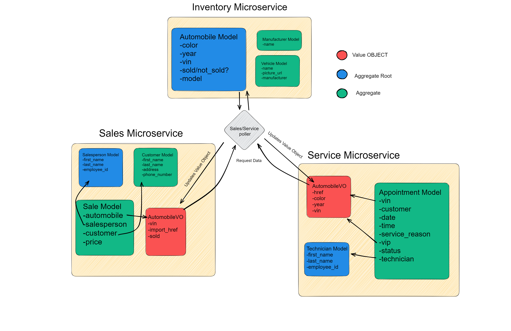

# CarCar

Team:

* Stephen Zhu - Service
* Chad Manuel - Sales

## Design


---
## Running the Project

#### Requirements:

* Docker
* Google Chrome or any browser

#### Installation
1. Fork Project by clicking Fork on top right of project(Login Required)
2. Press Clone to grab URL from Forked project page then open up a terminal and run the git clone command.
```
    git clone "URL HERE"
```
3. Once the clone finishes, navigate to the correct directory by running this command in your terminal.
```
    cd project-beta
```
4. While the terminal and run the following commands(Ensure Docker is running)
```
    1. docker volume create beta-data
    2. docker-compose build
    3. docker-compose up
```
5. There should be 7 containers that are running(The containers should be green)
6. Wait until the terminal shows `You can now view app in the browser.`
7. Open up Chrome(Browser) and type in `http://localhost:3000/` in the address bar.
---

## Inventory Microservice

The inventory microservice is consisted of three models: Manufacturer, VehicleModel, and Automobile. The inventory microservice handles all of the data of all the vehicles in the app.

The `Manufacturer` model has a single property, `name` which holds the data to all manufacturer types available in the inventory.

The `VehicleModel` has the properties of `name`, `picture_url`, `manufacturer`. The manufacturer property is a foreign key which refers to the `Manufacturer` model for the manufacturer name. The `name` property takes an input for the vehicle model's name. The `picture_url` takes an input of a picture url.

The `Automobile` model has the properties of `color`, `year`, `vin`, `sold`, and `model`. Other microservices such as the service and sales microservice use a poller in order to retrieve information from this model. The `model` property is a foreign key which refers to the `VehicleModel` for the vehicle model's name. The `color` property takes an input for the vehicle's color. The `year` property takes in an integer for the vehicle's year. The `vin` property takes an input for the VIN number of the vehicle. The `sold` property is set to false by default.

#### Manufacturers API

| Action | Method | URL |
| ----------- | ----------- | ----------- |
| List manufacturers | GET | `http://localhost:8100/api/manufacturers/` |
| Detail of a manufacturer | GET | `http://localhost:8100/api/manufacturers/:id/` |
| Create a manufacturer | POST | `http://localhost:8100/api/manufacturers/` |
| Update a manufacturer | PUT | `http://localhost:8100/api/manufacturers/:id/` |
| Delete a manufacturers | DELETE | `http://localhost:8100/api/manufacturers/:id/` |

<details>
<summary>GET: List of manufacturers</summary>

Returns:
```
{
	"manufacturers": [
		{
			"href": "/api/manufacturers/1/",
			"id": 1,
			"name": "Honda"
		}
	]
}
```
</details>

<details>
<summary>GET: Get manufacturer details</summary>

Returns:
```
{
	"href": "/api/manufacturers/1/",
	"id": 1,
	"name": "Honda"
}
```
</details>

<details>
<summary>POST: Creating a new manufacturer</summary>

```
{
  "name": "Honda"
}
```
Returns:
```
{
	"href": "/api/manufacturers/1/",
	"id": 1,
	"name": "Honda"
}
```
</details>

<details>
<summary>PUT: Updating a manufacturer</summary>

```
{
  "name": "Toyota"
}
```
</details>

#### Models API

| Action | Method | URL |
| ----------- | ----------- | ----------- |
| List models | GET | `http://localhost:8100/api/models/` |
| Detail of a model | GET | `http://localhost:8100/api/models/:id/` |
| Create a model | POST | `http://localhost:8100/api/models/` |
| Update a model | PUT | `http://localhost:8100/api/models/:id/` |
| Delete a model | DELETE | `http://localhost:8100/api/models/:id/` |

<details>
<summary>GET: List of models</summary>

Returns:
```
{
	"models": [
		{
			"href": "/api/models/1/",
			"id": 1,
			"name": "CR-V",
			"picture_url": "https://encrypted-tbn2.gstatic.com/images?q=tbn:ANd9GcSw_ji4NaKoArMM_ObGKvLTtN9hYjUhGQLslapXctzqle10Ghjx",
			"manufacturer": {
				"href": "/api/manufacturers/1/",
				"id": 1,
				"name": "Honda"
			}
		}
	]
}
```
</details>

<details>
<summary>GET: Get model details</summary>

Returns:
```
{
	"href": "/api/models/1/",
	"id": 1,
	"name": "CR-V",
	"picture_url": "https://encrypted-tbn2.gstatic.com/images?q=tbn:ANd9GcSw_ji4NaKoArMM_ObGKvLTtN9hYjUhGQLslapXctzqle10Ghjx",
	"manufacturer": {
		"href": "/api/manufacturers/1/",
		"id": 1,
		"name": "Honda"
	}
}
```
</details>

<details>
<summary>POST: Creating a new model</summary>

```
{
  "name": "CR-V",
  "picture_url": "https://encrypted-tbn2.gstatic.com/images?q=tbn:ANd9GcSw_ji4NaKoArMM_ObGKvLTtN9hYjUhGQLslapXctzqle10Ghjx",
  "manufacturer_id": 1
}
```
Returns:
```
{
	"href": "/api/models/1/",
	"id": 1,
	"name": "CR-V",
	"picture_url": "https://encrypted-tbn2.gstatic.com/images?q=tbn:ANd9GcSw_ji4NaKoArMM_ObGKvLTtN9hYjUhGQLslapXctzqle10Ghjx",
	"manufacturer": {
		"href": "/api/manufacturers/1/",
		"id": 1,
		"name": "Honda"
	}
}
```
</details>

<details>
<summary>PUT: Updating a model</summary>

```
{
  "name": "Passport",
  "picture_url": "https://encrypted-tbn0.gstatic.com/images?q=tbn:ANd9GcQEt2wRcjI0lwrZ4GM8T8NagukQ3UxX2OQirxUCMVvcAVYMQnYx"
}
```
</details>

#### Automobiles API

| Action | Method | URL |
| ----------- | ----------- | ----------- |
| List automobiles | GET | `http://localhost:8100/api/automobiles/` |
| Detail of automobile | GET | `http://localhost:8100/api/automobiles/:vin/` |
| Create a automobile | POST | `http://localhost:8100/api/automobiles/` |
| Update a automobile | PUT | `http://localhost:8100/api/automobiles/:vin/` |
| Delete a automobile | DELETE | `http://localhost:8100/api/automobiles/:vin/` |

<details>
<summary>GET: List of automobiles</summary>

Returns:
```
  {
	"autos": [
		{
			"href": "/api/automobiles/7D345DFKL/",
			"id": 4,
			"color": "grey",
			"year": 2020,
			"vin": "7D345DFKL",
			"model": {
				"href": "/api/models/1/",
				"id": 1,
				"name": "CR-V",
				"picture_url": "https://encrypted-tbn2.gstatic.com/images?q=tbn:ANd9GcSw_ji4NaKoArMM_ObGKvLTtN9hYjUhGQLslapXctzqle10Ghjx",
				"manufacturer": {
					"href": "/api/manufacturers/1/",
					"id": 1,
					"name": "Honda"
				}
			},
			"sold": false
		}
	]
}
```
</details>

<details>
<summary>GET: Get automobile detail by VIN</summary>

Returns:
```
{
	"href": "/api/automobiles/7D345DFKL/",
	"id": 4,
	"color": "grey",
	"year": 2020,
	"vin": "7D345DFKL",
	"model": {
		"href": "/api/models/1/",
		"id": 1,
		"name": "CR-V",
		"picture_url": "https://encrypted-tbn2.gstatic.com/images?q=tbn:ANd9GcSw_ji4NaKoArMM_ObGKvLTtN9hYjUhGQLslapXctzqle10Ghjx",
		"manufacturer": {
			"href": "/api/manufacturers/1/",
			"id": 1,
			"name": "Honda"
		}
	},
	"sold": false
}
```
</details>

<details>
<summary>POST: Creating a new automobile</summary>

```
{
  "color": "grey",
  "year": 2020,
  "vin": "7D345DFKL",
  "model_id": 1
}
```
Returns:
```
{
	"href": "/api/automobiles/7D345DFKL/",
	"id": 4,
	"color": "grey",
	"year": 2020,
	"vin": "7D345DFKL",
	"model": {
		"href": "/api/models/1/",
		"id": 1,
		"name": "CR-V",
		"picture_url": "https://encrypted-tbn2.gstatic.com/images?q=tbn:ANd9GcSw_ji4NaKoArMM_ObGKvLTtN9hYjUhGQLslapXctzqle10Ghjx",
		"manufacturer": {
			"href": "/api/manufacturers/1/",
			"id": 1,
			"name": "Honda"
		}
	},
	"sold": false
}
```
</details>

<details>
<summary>PUT: Updating an automobile by VIN</summary>

```
{
  "color": "blue",
  "year": 2018
}
```
</details>

---
## Service Microservice

The service microservice is made up of the following three models: AutomobileVO, Technician, and Appointment.

The `AutomobileVO` model has the properties of `import_href`, `color`, `year`, and `vin`.  This value object is used to represent the `Automobile model` in the **inventory microservice** by way of polling; because data is pulled from the **inventory microservice** to be used to update or create the value object for use.

The `Technician` model has the properties of `first_name`, `last_name`, and `employee_id`.  This model is used to create and store all data related to the technician(s).

The `Appointment` model has the properties of `date`, `time`, `service_reason`, `vin`, `customer`, `vip`, `status`, and `technician`.  This model is used to create and store data for all appointments made.  The date, time, service_reason, and customer fields are used to fill I basic information of appointment.  The vin is used to to keep track of the automobile vin while also being used in conjunction with the vip property to check whether a automobile is in the inventory and does it get **vip treatment**.  The technician Foreignkey  so that when the appointment is made there is a technician employee chosen as there can’t be an appointment if there’s no one designated to check the automobile.

Extra Note:
The `status` property is set to **default** on `“Created”` when an appointment is made so that it can be kept track of alongside with the options to change to `“Finished”` or `“Canceled”`.

The `vip` property is **default** set to `“False”` because there are cases where the automobile designated for the appointment was not from the dealership inventory.

#### Technicians API

| Action | Method | URL |
| ----------- | ----------- | ----------- |
| List Technicians | GET | `http://localhost:8080/api/technicians/` |
| Create a Technician | POST | `http://localhost:8080/api/technicians/` |
| Delete a Technician | DELETE | `http://localhost:8080/api/technicians/:id` |

<details>
<summary>GET: List of technicians</summary>

Returns:
```
{
	"technicians": [
		{
			"id": 1,
			"first_name": "James",
			"last_name": "Dun",
			"employee_id": "AC773L"
		}
	]
}
```
</details>

<details>
<summary>POST: Creating a new technician</summary>

```
{
	"first_name": "James",
	"last_name": "Dun",
	"employee_id": "AC773L"
}
```
Returns:
```
{
	"id": 1,
	"first_name": "James",
	"last_name": "Dun",
	"employee_id": "AC773L"
}
```
</details>

<details>
<summary>DELETE: Deleting a technician by id, not employee_id</summary>

Returns:
```
{
	"message": "Technician successfully deleted"
}
```
</details>

#### Appointments API

| Action | Method | URL |
| ----------- | ----------- | ----------- |
| List Appointments | GET | `http://localhost:8080/api/appointments/` |
| Create an Appointment | POST | `http://localhost:8080/api/appointments/` |
| Delete an Appointment | DELETE | `http://localhost:8080/api/appointments/:id` |
| Set Appointment to canceled | PUT | `http://localhost:8080/api/Appointments/:id/cancel` |
| Set Appointment to finished | PUT | `http://localhost:8080/api/Appointments/:id/finish` |

<details>
<summary>GET: List of appointments</summary>

Returns:
```
{
	"appointments": [
		{
			"id": 1,
			"customer": "Gabriel M",
			"date": "12-30-2023",
			"time": "11:00:00",
			"service_reason": "Check Engine Light",
			"vin": "7D345DFKL",
			"vip": false,
			"status": "Created",
			"technician": {
				"id": 1,
				"first_name": "James",
				"last_name": "Dun",
				"employee_id": "AC773L"
			},
		}
	]
}
```
</details>

<details>
<summary>POST: Creating a new appointment | Note: the status will show false unless a Automobile is created in the inventory first</summary>

```
{
	"customer": "Gabriel M",
	"date": "12-30-2023",
	"time": "11:00:00",
	"service_reason": "Check Engine Light",
	"vin": "7D345DFKL",
	"technician": 1
}
```
Returns:
```
{
	"id": 1,
	"customer": "Gabriel M",
	"date": "12-30-2023",
	"time": "11:00:00",
	"service_reason": "Check Engine Light",
	"vin": "7D345DFKL",
	"vip": false,
	"status": "Created",
	"technician": {
		"id": 1,
		"first_name": "James",
		"last_name": "Dun",
		"employee_id": "AC773L"
	},
}
```
</details>

<details>
<summary>PUT: Updating status of a appointment</summary>

Returns:
```
{
	"id": 1,
	"customer": "Gabriel M",
	"date": "12-30-2023",
	"time": "11:00:00",
	"service_reason": "Check Engine Light",
	"vin": "7D345DFKL",
	"vip": false,
	"status": "Finished",
	"technician": {
		"id": 1,
		"first_name": "James",
		"last_name": "Dun",
		"employee_id": "AC773L"
	},
}
```
</details>

<details>
<summary>DELETE: Deleting a appointment</summary>

Returns:
```
{
	"message": "Appointment successfully deleted"
}
```
</details>

---

## Sales Microservice
The sales microservice consists four models with one being a value object. These models are as follows: `Salespeople`, `Customers`, `Sale`, and `AutomobileVO` being the value object.

The `Salespeople` model consists of three properties: `first_name`, `last_name`, and `employee_id`. These properties are designed for create and store data related to sales people.

The `Customer` model consists of four  properties: `first_name`, `last_name`, `address`, and `phone_number`. These properties are made to create and store data related to customers.

The `Sale` model consists of four properties: `automobile`, `saleperson`, `customer`, and `price`. This model is dependent on the other model's data in order to create new instances of sale. The `automobile` property is a foreign key and is dependent on the `AutomobileVO` model to be updated with the automobile's VIN. The `salesperson` property is also a foreign key is dependent from `Salesperson` model to provide the sales person's name. The `customer` property is also a foreign key and is dependent the `Customer` to provide the customer's name. Finally, the `price` property takes in an input to establish the price of the automobile.

The `AutomobileVO` acts as a representation of the `Automobile` model from the inventory microservice. It holds the VIN information from the original model and is updated once every sixty seconds using a poller. The sales microservice can maintain a copy of the automobile data that is consistent with the inventory microservice because of the automobile value object.

#### Sales People API

| Action | Method | URL |
| ----------- | ----------- | ----------- |
| List salespeople | GET | `http://localhost:8090/api/salespeople/` |
| Create a sales person | POST | `http://localhost:8090/api/salespeople/` |
| Delete a sales persone | DELETE | `http://localhost:8090/api/salespeople/:id` |

<details>
<summary>GET: List of sales people</summary>

The Json returned should be as follows:
```
{
	"salespeople": [
		{
			"first_name": "Chad",
			"last_name": "Sales",
			"employee_id": "CSales",
			"id": 1
		},
		{
			"first_name": "Shannon",
			"last_name": "Kears",
			"employee_id": "SKears",
			"id": 2
		}
	]
}
```
</details>


<details>
<summary>POST: Create a sales person</summary>

Input:
```
{
	"first_name": "Michelle",
	"last_name": "Jackson",
	"employee_id": "MJackson"
}
```

Once successfully created, the output should be as follows:
```
{
	"salespeople": {
		"first_name": "Michelle",
		"last_name": "Jackson",
		"employee_id": "MJackson",
		"id": 3
	}
}
```
</details>

<details>
<summary>DELETE: Remove a sales person</summary>

Once successful, the output should be as follows:
```
{
	"deleted": true
}
```
</details>

#### Customers API
| Action | Method | URL |
| ----------- | ----------- | ----------- |
| List Customers | GET | `http://localhost:8090/api/customers/` |
| Create a Customer | POST | `http://localhost:8090/api/customers/` |
| Delete a Customer | DELETE | `http://localhost:8090/api/customers/:id` |

<details>
<summary>GET: List of customers</summary>

The Json returned should be as follows:
```
{
	"Customer": [
		{
			"first_name": "Justin",
			"last_name": "Henry",
			"address": "3990 School Street",
			"phone_number": "209-944-4227",
			"id": 1
		}
	]
}

```
</details>

<details>
<summary>POST: Create Customer</summary>


The Json body inputted to create a customer should be as follows:
```
{
	"first_name": "Israel",
	"last_name": "Sellers",
	"address": "3170 Bell Street New York, NY",
	"phone_number": "212-271-2646"
}
```

Once successfully created, the output should be as follows:
```
{
	"Customer": {
		"first_name": "Israel",
		"last_name": "Sellers",
		"address": "3170 Bell Street New York, NY",
		"phone_number": "212-271-2646",
		"id": 2
	}
}
```
</details>

<details>
<summary>DELETE: Remove a Customer</summary>

Once successful, the output should be as follows:
```
{
	"deleted": true
}
```
</details>

#### Sale API
| Action | Method | URL |
| ----------- | ----------- | ----------- |
| List Sales | GET | `http://localhost:8090/api/sale/` |
| Create a Sale | POST | `http://localhost:8090/api/sale/` |
| Delete a Sale | DELETE | `http://localhost:8090/api/sale/:id` |

<details>
<summary>GET: List of sales</summary>

The Json returned should be as follows:
```
{
	"Sales": [
		{
			"customer": {
				"first_name": "Gloria",
				"last_name": "Mayo",
				"address": "1567 Weekley Street San Antonio, TX",
				"phone_number": "210-389-3813",
				"id": 1
			},
			"automobile": {
				"vin": "2374678236478e34",
				"id": 1,
				"sold": false
			},
			"salesperson": {
				"first_name": "Louella",
				"last_name": "Sullivan",
				"employee_id": "LSullivan",
				"id": 1
			},
			"price": 132423,
			"id": 1
		},
    ]
}
```
</details>

<details>
<summary>POST: Creating a Sale</summary>

The Json body inputted to create a sale should be as follows:
```
{
  "automobile": "AUTO VIN",
  "salesperson": "Salesperson ID",
  "customer": "customer ID",
  "price": "price"
}
```

Once successfully created, the output should be as follows:
```
{
	"customer": {
		"first_name": "Customer First Name",
		"last_name": "Customer Last Name",
		"address": "4679 Jett lane Santa Ana, CA",
		"phone_number": "310-76-6405",
		"id": 1
	},
	"automobile": {
		"vin": "2374678236478e34",
		"id": 1,
	},
	"salesperson": {
		"first_name": "Sales Person First Name",
		"last_name": "Sales Person Last Name",
		"employee_id": "Sales Person Employee ID",
		"id": 1
	},
	"price": "Price of Automobile",
	"id": 3
}

```

</details>

<details>
<summary>DELETE: Remove a Customer</summary>

Once successful, the output should be as follows:
```
{
	"deleted": true
}
```
</details>
